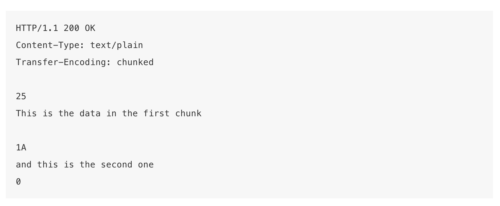

# HTTP协议

## HTTP的特性

* HTTP协议是构建于TCP/IP协议之上，是一个应用层，默认端口号是 80。
* HTTP是无连接无状态的。

## HTTP报文

### 请求报文

HTTP协议是以ASCⅡ码传输，建立在TCP/IP之上的应用层规范，规范把HTTP请求分为三个部分：状态行，请求头，消息主体。类似于下面这样：

```json
<method> <request-URL><version>
<headers>
<entity-body>
```

HTTP定义了与服务器交互的不同方法，最基本的有四种：GET, POST, PUT, DELETE. URL的全称是资源描述符，我们可以这样认为: 一个URL地址，用于描述一个网络上的资源，而HTTP中定义的交互方法就对应着对资源进行的操作（增删改查）。

1. GET用于获取信息，两个特点，安全，幂等。
   1. 安全：对资源只有查询操作，不会影响资源状态（读同一个文件太多会影响吧）
   2. 幂等意为多次GET请求，得到的返回数据应该是一样的。
2. POST 可能会修改服务器上的资源
3. 注意:
   1. GET可提交的数据量受URL长度限制，但HTTP规范没有对URL长度做限制，但是一般浏览器会限制小于256K
   2. 理论上讲POST没有大小限制，HTTP协议也没有限制，但是出于安全考虑，POST参数一般小于5M。
   3. 参考报文示例，可以发现GET和POST数据内容一个放在URL里，一个放在HTTP包的包体（body）里

GET请求报文示例：

```json
GET /books/?name=javascript&price=100 HTTP/1.1
HOST: www.example.com
User-Agent: Mozilla/5.0 (Windows; U; Windows NT 5.1; en-US; rv:1.7.6) Geoko/20050225 Firefox/1.0.1
Connection: Keep-Alive
```

### POST提交数据的方式

HTTP协议规定POST的数据必须在BODY部分中，但是未规定数据编码格式，服务端常通过请求头里的Content-Type来判断数据的编码格式。所以说POST提交数据方案包含两方面，Content-Type 和 消息主体编码方式两部分。

* application/x-www-form-urlencoded
  * 最常见的数据提交方式，form表单原生提交格式
* multipart/form-data
  * 常见方式，需设置 enctype = multipart/form-data, 主要用途一般是文件上传。
* text/plain 很少用
* application/json
  * 用的会多一些，因为后端可以直接拿json去匹配model，操作上比较方便，前端需设置，如axios 需设置type为'json'。
* text/xml
* application/x-protobuf

multipart/form-data示例

```json
POST http://www.example.com HTTP/1.1
Content-Type:multipart/form-data; boundary=----WebKitFormBoundaryrGKCBY7qhFd3TrwA

------WebKitFormBoundaryrGKCBY7qhFd3TrwA
Content-Disposition: form-data; name="text"

title
------WebKitFormBoundaryrGKCBY7qhFd3TrwA
Content-Disposition: form-data; name="file"; filename="chrome.png"
Content-Type: image/png

PNG ... content of chrome.png ...
------WebKitFormBoundaryrGKCBY7qhFd3TrwA--
```

### 响应报文

HTTP响应与HTTP请求类似，也由3个部分组成，分别是：状态行，响应头，响应正文。
状态行由协议版本，数字形式的状态码，相应的状态描述组成，各元素之间以空格分隔。
常见状态码有以下几种：

* 200 OK 客户端请求成功
* 301 Moved Permanently 请求永久重定向
* 302 Moved Temporarily 请求临时重定向。
* 304 Not Modified 文件未修改，可以直接使用缓存的文件。
* 400 Bad Request 由于客户端请求有语法错误，不能被服务器理解。
* 401 Unauthorized 请求未授权。这个状态码必须和www-Authenicate报头域一起使用。
* 403 Forbidden 服务收到请求，但拒绝提供服务。服务器通常会在响应正文中给出不提供服务的原因。
* 404 Not Found 请求的资源不存在。
* 500 Internal Server Error 服务器发生了不可预期的错误，导致无法完成客户端请求。
* 503 Service Unavailable 服务器当前不能处理客户端请求，在一段时间后可能恢复正常。

一个HTTP响应的例子：

```json
HTTP/1.1 200 OK

Server:Apache Tomcat/5.0.12
Date: Mon,6Oct2019 13:23:42 GMT
Content-Length:112

<html>...
```

### 条件GET

当要重复访问一个已经访问过的资源时，客户端可以首先发一个包询问资源是否已更新，如果没更改，则服务端返回一个304，让客户端使用缓存的资源文件即可。如果已更改，则正常返回资源。判断条件就是请求header中的If-Modified-Since.

### 持久连接

HTTP使用请求-应答的模式，而且是无连接的协议，所以在HTTP 1.0里，默认是每次请求都会建立一个新的连接，完成后立即断开。当然可以通过connection:Keep-Alive 来要求建立持久连接，这样就不用每次都创建新连接了。在HTTP1.1中已经是默认就是持久连接了，通过connection: close来关闭。
注意:

* HTTP Keep-Alive 简单说就是保持当前TCP连接。
* HTTP 连接不会一直持续，有timeout和max，代表超时和超过多少次断开。
* HTTP是无状态协议，所以不能依赖keep-alive，每个请求都是独立的
* 使用持久连接后，客户端和服务端通过content-length来判断请求传输结束。动态生成的文件没有content-length，是分块传输（chunked），这种的根据chunked编码最后的chunked块来判断。

### Transfer-Encoding （chuned分块传输）

Transfer-Encoding 是一个用来标示 HTTP 报文传输格式的头部值。尽管这个取值理论上可以有很多，但是当前的 HTTP 规范里实际上只定义了一种传输取值——chunked。  
如果一个HTTP消息（请求消息或应答消息）的Transfer-Encoding消息头的值为chunked，那么，消息体由数量未定的块组成，并以最后一个大小为0的块为结束。  
每一个非空的块都以该块包含数据的字节数（字节数以十六进制表示）开始，跟随一个CRLF （回车及换行），然后是数据本身，最后块CRLF结束。在一些实现中，块大小和CRLF之间填充有白空格（0x20）。  
最后一块是单行，由块大小（0），一些可选的填充白空格，以及CRLF。最后一块不再包含任何数据，但是可以发送可选的尾部，包括消息头字段。消息最后以CRLF结尾。
chunked响应示例：



注意：

* chunked 和 multipart 两个名词在意义上有类似的地方，不过在 HTTP 协议当中这两个概念则不是一个类别的。multipart 是一种 Content-Type，标示 HTTP 报文内容的类型，而 chunked 是一种传输格式，标示报头将以何种方式进行传输。
* chunked 传输不能事先知道内容的长度，只能靠最后的空 chunk 块来判断，因此对于下载请求来说，是没有办法实现进度的。在浏览器和下载工具中，偶尔我们也会看到有些文件是看不到下载进度的，即采用 chunked 方式进行下载。
* chunked 的优势在于，服务器端可以边生成内容边发送，无需事先生成全部的内容。HTTP/2 不支持 Transfer-Encoding: chunked，因为 HTTP/2 有自己的 streaming 传输方式。

### HTTP Pipelining（HTTP管线化）

默认情况下 HTTP 协议中每个传输层连接只能承载一个 HTTP 请求和响应，浏览器会在收到上一个请求的响应之后，再发送下一个请求。在使用持久连接的情况下，某个连接上消息的传递类似于请求1 -> 响应1 -> 请求2 -> 响应2 -> 请求3 -> 响应3。  
HTTP Pipelining（管线化）是将多个 HTTP 请求整批提交的技术，在传送过程中不需等待服务端的回应。使用 HTTP Pipelining 技术之后，某个连接上的消息变成了类似这样请求1 -> 请求2 -> 请求3 -> 响应1 -> 响应2 -> 响应3。
注意下面几点：

* 管线化机制通过持久连接（persistent connection）完成，仅 HTTP/1.1 支持此技术（HTTP/1.0不支持）
* 只有 GET 和 HEAD 请求可以进行管线化，而 POST 则有所限制。
* 初次创建连接时不应启动管线机制，因为对方（服务器）不一定支持 HTTP/1.1 版本的协议
* 管线化不会影响响应到来的顺序，如上面的例子所示，响应返回的顺序并未改变
* HTTP /1.1 要求服务器端支持管线化，但并不要求服务器端也对响应进行管线化处理，只是要求对于管线化的请求不失败即可
* 由于上面提到的服务器端问题，开启管线化很可能并不会带来大幅度的性能提升，而且很多服务器端和代理程序对管线化的支持并不好，因此现代浏览器如 Chrome 和 Firefox 默认并未开启管线化支持

### 会话跟踪

1. 什么是会话？
    客户端打开与服务器之间的连接，发出请求到服务器，服务器响应客户端的请求的整个过程叫会话
2. 什么是会话跟踪？
    会话跟踪指的是对同一个用户对服务器的连续的请求和接受响应的监视。
3. 为什么要进行会话跟踪？
    浏览器与服务器之间的通信是通过HTTP协议进行通信的，而HTTP协议是”无状态”的协议，它不能保存客户的信息，即一次响应完成之后连接就断开了，下一次的请求需要重新连接，这样就需要判断是否是同一个用户，所以才有会话跟踪技术来实现这种要求。
