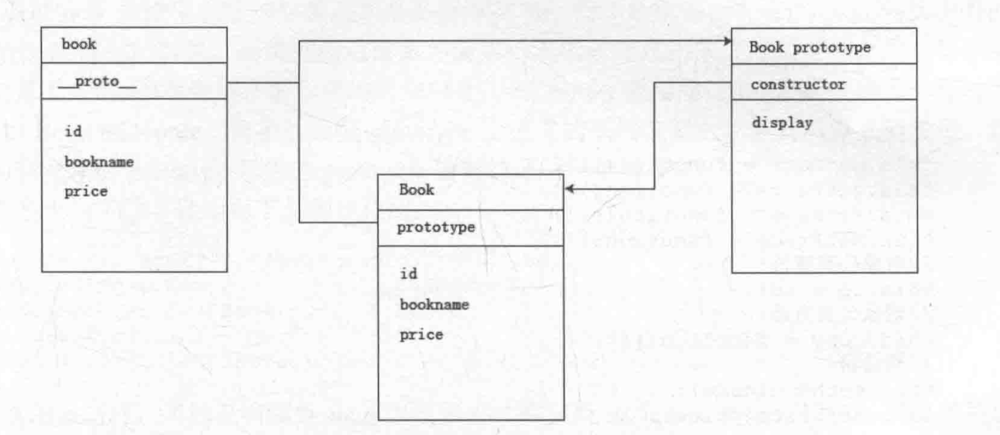
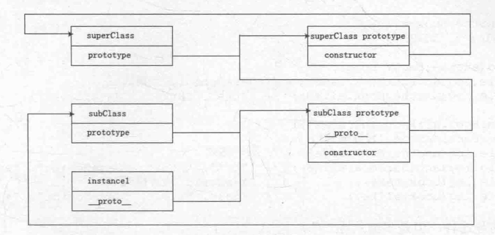
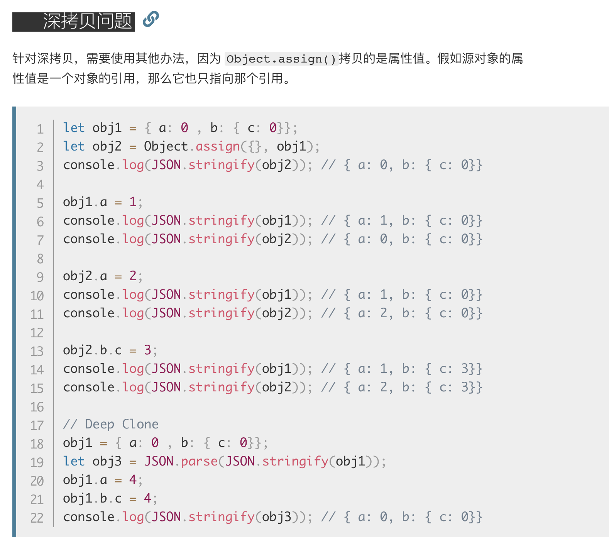

# 面向对象编程

## 面向过程和面向对象

使用传统的方法，按钮触发事件，以函数为主体按流程解决需求的方式，是一种面向过程的开发方式

而**面向对象编程**，就是将需求抽象成一个对象，针对这个对象分析属性和方法。这个对象称为类（class），面向对象的重要特点是**封装**。

## 封装

如何创建类？
ES5：

```javascript
/**
 * 类定义方法
 * @params cfg 初始化时自定义参数
 */
var myClass = function(cfg) {
    var self = this;
    self.XXX = cfg && cfg.XXX;  // 以此类推好多属性赋值
    self.XXX()  // 类创建时执行一部分方法
}
myClass.prototype = {
    XXX: function() {}
}

var temp = new myClass(cfg)
```

ES6:

```js
class myClass extend Object {
    constructor(cfg) {
        super();
        // do something
    }
    static _XXX() {};
    XXX() {};
};
let temp = new myClass(cfg);
```

通过this添加的属性和方法，是在当前对象上添加的，然而js是一种基于原型prototype的语言，所以每创建一个对象（JS中，函数也是一种对象）时，它都有一个原型prototype用于指向其继承的属性和方法。这样**通过prototype继承来的方法不是来自对象自身的**，所以在使用时，需要通过prototype一直向上查找来得到。而通过this定义的属性或方法则是该对象自身拥有的，**所以每次通过类创建新对象时，this定义的属性和方法都会创建一次，而通过prototype继承来的属性或方法是每个对象通过prototype访问到的，所以不会每次都创建。**
如下图示


图中constructor的意思：
constructor是一个属性，约等于prototype中的this。constructor指向的是拥有整个prototype的函数或对象。
声明在函数内部的方法和变量是创建类的私有变量和私有方法，在函数内部通过this暴露出来的方法和变量是共有属性和共有方法。共有属性和方法可以访问到私有属性和私有方法。
在类外面通过点语法添加的属性和方法在创建类时没有执行到，所以称为类的静态共有属性和静态共有方法。而通过prototype创建的属性或方法在类的实例对象中可以通过this访问到，所以通过prototype创建的属性和方法称为共有属性和共有方法

```javascript
var Book = function(cfg) {
    // 安全模式，如果this属于Book类则说明是在用new关键字创建对象，（检察官在此）
    if (!this instanceof Book) return new Book(cfg);

    var privateArg = 1; // 私有变量
    function privateFunc() {}   // 私有方法

    this.getName = function() {}    // 公有方法（特权方法）
    this.setName = function(args) {};

    this.setName(privateArg)    // 构造器
}
Book.isNew = true;  // 静态共有属性，类本身能访问，对象不能访问
Book.checkNew = function() {}   // 静态共有方法，类本身能访问，对象不能访问
Book.prototype = {
    isJSBook: true, // 公有属性
    findName: function() {} // 公有方法
}
```

new关键字的作用可以看作是**对当前对象的this不停的赋值**

安全的使用class，使用安全模式，在函数内部执行过程中判断this是否是当前对象。

## 继承

### 类式继承

子类的原型设置为父类的实例

```javascript
// 声明父类
function SuperClass () {
    this.superValue = true;
}
// 为父类添加共有方法
SuperClass.prototype.getSuperValue = function() {
    return this.superValue;
};
// 声明子类
function SubClass() {
    this.subValue = false;
}
// 子类继承父类
SubClass.prototype = new SuperClass();
// 子类添加共有方法
SubClass.prototype.getSubValue = function() {
    return this.subValue;
};
```

类继承原理：类的原型对象的作用就是为类的原型添加共有方法，但是类不能直接访问这些属性和方法，必须通过原型prototype来访问，而我们实例化一个父类时，新创建的对象复制了父类的原型对象上的属性与方法并将原型_proto_指向了父类的原型对象，而且新创建的对象可以直接访问父类原型对象上的属性和方法和父类从构造函数中复制的属性和方法，如果我们将这个新创建的对象赋值给子类的原型，那么子类的原型就可以访问到父类的原型属性和方法了。

类继承缺点：

1. 子类通过原型对父类实例化，继承了父类，则父类的共有属性如果是引用属性，就会在子类中被所有实例共用，因此一个子类实例更改子类原型（父类实例）中继承来的共有属性就会直接影响到其他子类。

2. 由于子类实现的继承是靠其原型prototype对父类实例化实现的，因此在创建父类时无法传递参数，因而在实例化父类的时候也无法对父类构造函数内的属性进行初始化。

这些问题可以通过其他继承方法来解决，比如下面的构造函数继承.

### 构造函数继承

```javascript
// 构造函数式继承
// 声明父类
function SupercLASS(cfg) {
    // 引用类型共有属性
    this.books = ['1', '2', '3'];
    this.id = cfg.id;
}
// 父类声明原型方法
SuperClass.prototype.showBooks = function() {console.log(this.books)};
// 声明子类
function SubClass(cfg) {
    SuperClass.call(this, cfg);
};
// 创建子类的实例
var instance1 = new SubClass({id: 1});
var instance2 = new SubClass({id: 2});
instance1.books.push('4');
instance1.books;  // ['1', '2', '3', '4']
instance2.books;  // ['1', '2', '3']
instance1.showBooks(); // TypeError
```

构造函数继承通过使用call方法，SuperClass.call(this, cfg) 此代码意为使用this为当前语境的this来执行一遍SuperClass, 也就是把SuperClass构造函数里的constructor变为当前语境（子类）的this，导致父类构造函数里定义的共有方法和变量，在每个子类实例化时都生成了新的，从而达到共有属性不被污染的目的，但是由此带来一个问题，call语法走完父类实例化的过程，但这过程与prototype无关，所以子类没有继承父类的原型对象，导致父类的原型对象上的方法和属性无法被子类使用。

### 组合继承

解决类继承和构造函数继承的问题，简单粗暴的保留两种特性：

1. 类继承：通过子类型prototype对父类实例化

2. 构造函数继承：通过在子类构造函数作用环境中执行一次父类的构造函数

```javascript
// 组合式继承
// 声明父类
function SuperClass(cfg) {
    // 值类型共有属性
    this.id = cfg.id;
    // 引用类型共有属性
    this.books = ['1', '2'];
}
SuperClass.prototype.getName = function() {
    console.log(this.id)
};
// 声明子类
function SubClass(cfg) {
    // 构造函数式继承父类属性
    SuperClass.call(this, cfg);
    // 子类中新增共有属性
    this.name = cfg.name;
}
// 类式继承
SubClass.prototype = new SuperCalss();
// 子类原型方法
SubClass.prototype.getTime = function() {
    console.log(this.name);
};
```

组合继承方式的缺点：

1. 在子类构造函数时执行了一遍父类的构造函数，在子类原型引用时又执行了一遍父类构造函数，调用了两遍，不太完美

### 原型式继承

```javascript
function inheritObject(o) {
    function F() {};
    F.prototype = o;
    return new F();
}
```

每次调用原型式继承都会生成一个空F的类，后来用Object.create()代替，这个和类继承有一样的缺点，值类型的属性被复制，引用类型的属性被共用。

### 寄生式继承

针对原型式继承做了二次封装，在封装过程中对继承的对象做了扩展, 但是依然没有解决原型式继承的问题啊

```javascript
var book = {
    name: '1',
    alikeBook: ['q', 'w']
};
function createBook(obj) {
    // 通过原型继承创建新对象
    var o = new inheritObject(obj);
    // 扩展新对象
    o.getName = function() {
        console.log(name)
    };
    // 返回扩展后的新对象
    return o;
}
```

### 终极杀人王 —— ~~火云邪神~~ 寄生组合式继承

寄生式继承依托于原型继承，原型继承又和类式继承很像，所以组合就是寄生式与构造函数式继承组合~

魔改寄生式继承

```javascript
function inheritPrototype(subClass, SuperClass) {
    // 复制一份父类原型在变量中
    // 实例化的一个类，原型是父类的原型
    var p = inheritObject(SuperClass.prototype);
    // 修正因为重写子类原型导致子类的constructor属性被修改
    p.constructor = SubClass;
    // 设置子类原型
    SubClass.prototype = p;
}

// 具体使用例子
// 定义父类
function SuperClass(name) {
    this.name = name;
    this.colors = ['blue', 'red'];
}
// 定义父类原型方法
SuperClass.prototype.getName = function() {
    console.log(this.name)
}
// 定义子类
function SubClass(name, time) {
    // 构造函数式继承
    SuperClass.call(this, name);
    // 子类共有属性
    this.time = time;
}
// 寄生式继承父类原型
inheritPrototype(SubClass, SuperClass);
// 子类新增原型方法
SubClass.prototype.getTime = function() {
    console.log(this.time)
}
var ins1 = new SubClass('js book', 2013);
var ins2 = new SubClass('JAVA', 2017);
ins1.colors.push('black');
console.log(ins1.colors);   // ['blue', 'red', 'black']
console.log(ins2.colors);   // ['blue', 'red']
ins2.getName(); // JAVA
ins2.getTime(); // 2017
```

放一张看不懂的图，描述寄生式组合继承的：



在这里插播一下：
基本数据类型7种：null, undefined, string, number, boolean, object, symbol
基本数据中：null, undefined, string, number, boolean 是值类型， object是引用类型。
值类型中：string, number, boolean是包装对象，也就是这三种在创建时会自动给包装成对象的样子，所以这三种会有一些方法和属性，如length, toUppercase()等
多说一句：值类型存储在栈里，引用类型把属性存在堆里，指针（引用）存在栈里。

## 多继承

### extend方法（继承单对象属性）

```javascript
// 浅拷贝，只能搞定值类型属性，搞不定引用类型属性
var extend = function(target, source) {
    for (var property in source) {
        target[property] = source[property]
    }
    return target
}
// 那么深拷贝怎么做呢? 简单的办法，做一个迭代，发现有引用类型就再循环一次，把引用类型再copy一遍放在对象里
```

so, 多继承如何实现呢？就是使用这样的方式，但是参数变为多个对象，就是多继承啦，好像jQuery的extend已经支持多参数的多继承了。甚至Object.assign({}, target1, target2); 这种浅拷贝合并后的对象，再extend进原型，也是一种多继承的方式。
但是注意，Object.assign只能深拷贝第一级的对象，对象内部的对象并不会拷贝，所以慎用，图上讲的更简单易懂：



## 多态

根据传入参数不同（个数，类型），执行不同操作返回不同结果的特性叫多态，easy，不展开了。

## 总结

封装与继承是面向对象中的两个主要特性，继承即是对原油对象的封装，从中创建私有属性，私有方法，共有属性，共有方法等，对于每种属性与每种方法的特点是不一样的，有些不论对类如何创建，它只创建一次，这类的方法与属性称之为静态的，有的只被类拥有，那么这种属性和方法是静态类属性和静态类方法。当然可被继承的方法与属性无外乎两类，一类是在构造函数中，在对象被实例化时复制一遍，另一类在类的原型对象中，这类属性和方法在对象实例化时被所有实例化对象所共用。
